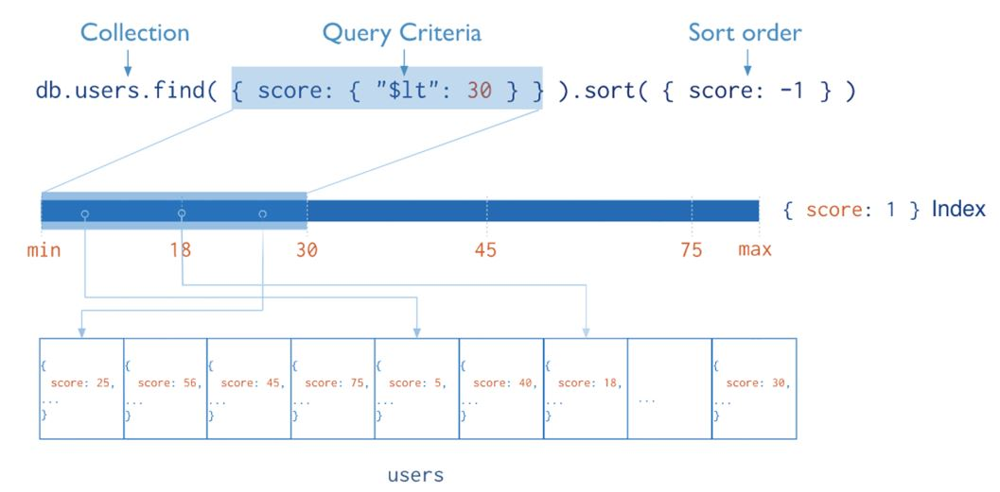

# MongoDB Indexes

> - Data structure that improves the efficiency of read operations
> - Can be created using one or more fields of the document
> - Without indexes, collection scan
> - With indexes, index scan

## Introduction
- Stores a small portion of collection’s data set
- Stores the value of specific field(s), ordered by the value of the field
- The ordering of the index supports:
  - efficient equality matches
  - range-based queries
  - Faster sort results
- It comes with:
  - Cost of additional writes
  - Additional storage space
- below diagram illustrates indexing    

### Types of Indexes
> 
  - Indexes on a single field of a document
> Compound Index
  - Indexes on multiple fields of a document
    
> Multikey Index
  - Index on the content stored in arrays
    
> Geospatial Index
> - To support efficient queries of geospatial coordinate data, MongoDB provides two special indexes:
>> 2d Index
>  - Supports Planar geometry data
>> 2dsphere Index
>  - Supports Spherical geometry data

> Text Index
  - Index type that supports searching for string field
> Hashed Index
  - Index to support the hash based sharding
> Wildcard Indexes
  - Index to support queries against unknown or arbitrary field
